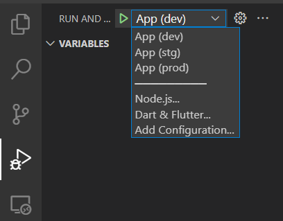

# Flutter App - My Starred Repos

[![platform: flutter][flutter_badge_link]][flutter_link]
[![style: lint][lint_badge_link]][lint_package_link]
[![codecov][codecov_badge_link]][codecov_project_link]
[![melos][melos_badge_link]][melos_link]

A demo app project made with [Flutter][flutter_link] by [mrverdant13][mrverdant13_link].

This app shows your favorites GitHub repositories. You can search for other repos, preview them, and star or un-star them.

---

# Features

## Platform-specific features

|                                           | Android | iOS | Web | Linux | Windows | MacOS |
| :---------------------------------------- | :-----: | :-: | :-: | :---: | :-----: | :---: |
| Native flavors                            |   ✔️    | ✔️  | ➖  |  ➖   |   ➖    |  ➖   |
| Different app icon per flavor             |   ✔️    | ✔️  | 🔍  |  🔍   |   🔍    |  🔍   |
| Different app splash per flavor           |   ✔️    | 📌  | 🔍  |  🔍   |   🔍    |  🔍   |
| Different app splash per dark/light theme |   ✔️    | 🔍  | 🔍  |  🔍   |   🔍    |  🔍   |
| App signing pre-configuration             |   ✔️    | 🔍  | 🔍  |  🔍   |   🔍    |  🔍   |
| Internationalization                      |   ✔️    | 📌  | 🔍  |  🔍   |   🔍    |  🔍   |

<br/>

| Tag | Description           |
| :-: | :-------------------- |
| ✔️  | Implemented           |
| 📌  | Not implemented (yet) |
| ➖  | Not applicable        |
| 🔍  | Under investigation   |

## Project-wide features

- Mono-repo structure using [melos][melos_link].
- Flutter-level flavors by using different entry points per flavor.
- Conditional features implementation based on the selected build flavor and a given config file.
- Modular and composable logger with the [lumberdash package][lumberdash_package_link], which can be easily integrated with [Firebase Analytics][firebase_analytics_link] or [Sentry][sentry_link].
- CI/CD:
  - GitHub Actions:
    - Code formatting
    - Code analysis (considering info and warning level issues as fatal)
    - Unit testing (randomizing tests execution)
    - 100% coverage check (ignoring generated files)
    - Automatic coverage info upload to [codecov.io][codecov_link]
- GitHub issue templates.
- GitHub pull request template.
- Strong lint rules with the [lint package][lint_package_link].
- IDE launch setup:
  - Visual Studio Code
- Secure app configuration based on a bundled config file (looking for a safer method 🔍).
- Directional dependency injection independent of the widgets tree with [riverpod][riverpod_link].
- Raw OAuth flow implementation with GitHub specifications.
- ETag-based data caching for basic offline mode support.
- REST API server integration.
- GraphQL server integration.

---

# Prerequisites

## Required

- [Flutter 2][flutter_link] to build and test the project.

  You could follow the [official docs about installation][flutter_installation_link].

- A [GitHub OAuth App][github_oauth_apps_link] to provide auth functionality.

  You could check the [official docs about GitHub OAuth apps creation][github_oauth_apps_creation_link] considering the following parameters:

  - Homepage URL: `http://localhost:8080`

  - Authorization callback URL: `http://localhost:3000/callback`

  **NOTE:** The client ID and a client secret are necessary.

## Optional

- `lcov` utils:

  - Windows: Run `choco install lcov` (you need [Chocolatey][chocolatey_link]).
  - Linux: Run `sudo apt install lcov`.
  - Mac: Run `brew install lcov` (you need [Homebrew][homebrew_link]).

- [remove_from_coverage][remove_from_coverage_package_link] package to ignore generated files in coverage info.

---

# App configuration

This project uses a YAML file as config data provider and it should be placed inside the `assets/config/` folder.

Its name should be `app_config.`_`<env_tag>`_`.yaml`, where _`<env_tag>`_ should be replaced by `dev`, `stg` or `prod` according to your desired flavor.

The schema of this config file should be as described below:

```yaml
# GitHub auth config data.
githubAuthConfig:
  # GitHub app client identifier.
  clientId: client_id
  # GitHub app client secret.
  clientSecret: client_secret
```

For easy setup, you can take the `assets/config/app_config.sample.yaml` sample file.

---

# App flavors

## Flutter-level flavors

This project supports 3 Flutter-level flavors that can be used directly with the launch configuration in Visual Studio Code or by executing one of the following commands:

```sh
# Development
$ flutter run --target lib/main_dev.dart

# Staging
$ flutter run --target lib/main_stg.dart

# Production
$ flutter run --target lib/main_prod.dart
```

> **Note 1:** The target path separator (`\` or `/`) might change according to the OS.

> **Note 2:** Each flavor use a config file to setup some elements. You should make sure that this file exists.

## Native flavors

This project supports 3 native flavors (**Android and iOS only**) that can be used directly with the launch configuration in Visual Studio Code or by executing one of the following commands:

```sh
# Development
$ flutter run --flavor dev --target lib/main_dev.dart

# Staging
$ flutter run --flavor stg --target lib/main_stg.dart

# Production
$ flutter run --flavor prod --target lib/main_prod.dart
```

> **Note 1:** The target path separator (`\` or `/`) might change according to the OS.

> **Note 2:** Each flavor use a config file to setup some elements. You should make sure that this file exists.

# IDE debugging

## Visual Studio Code

Follow these steps on [Visual Studio Code][vsc_link]:

1. Open the `Run and Debug` view.

   

2. Select the flavor you want to use and then click the _`Play`_ icon or press the _`F5`_ key to start debugging.

   

---

# Internationalization (app languages)

This project relies on [flutter_localizations][flutter_localizations_link] and follows the [official internationalization guide for Flutter][flutter_internationalization_link].

## Adding localized values

1. To add a new localizable string, open the `app_<locale ID>.arb` file at the `lib/l10n/arb/` folder.

   ```arb
   {
       "@@locale": "<locale ID>",

       ···

       "<valueKey>": "<value>",
       "@<valueKey>": {
           "description": "<description>"
       },

       ···

   }
   ```

2. Then add a new key, value and description

   ```arb
   {
       "@@locale": "<locale ID>",

       ···

       "<valueKey>": "<value>",
       "@<valueKey>": {
           "description": "<description>"
       },

       ···

       "<newValueKey>": "<new value>",
       "@<newValueKey>": {
           "description": "<new value description>"
       }
   }
   ```

3. Use the new string

   ```dart
   import 'package:<app_package_name>/l10n/l10n.dart';

   ···

     @override
     Widget build(BuildContext context) {
       final l10n = context.l10n;
       return Text(l10n.<newValueKey>);
     }

   ···

   ```

## Adding translations

1. For each supported locale, add a new ARB file in `lib/l10n/arb`.

   ```
   ├── lib
   │   ├── l10n
   │   │   ├── arb
   │   │   │   ├── app_<locale ID>.arb
   │   │   │   └── app_<new locale ID>.arb
   ```

2. Add the translated strings to each `.arb` file:

   `app_<locale ID>.arb`

   ```arb
   {
       "@@locale": "<locale ID>",

       ···

       "<valueKey>": "<value for locale ID>",
       "@<valueKey>": {
           "description": "<description for locale ID>",
       },

       ···

   }
   ```

   `app_<new locale ID>.arb`

   ```arb
   {
       "@@locale": "<new locale ID>",

       ···

       "<valueKey>": "<value for new locale ID>",
       "@<valueKey>": {
           "description": "<description for new locale ID>"
       },

       ···

   }
   ```

## Complex use cases

For more complex needs, you could check the following resources:

- [Flutter Internationalization User Guide][flutter_internationalization_user_guide_link]
- [Application Resource Bundle Specification][application_resource_bundle_specification_link]

# Testing

1.  To run all unit and widget tests, execute the following command:

    ```sh
    $ flutter test -x ci-only --coverage -r expanded --test-randomize-ordering-seed random
    ```

    > **Note:** The `-x ci-only` excludes tests tagged as `ci-only`, which indicated that they should be run on CI/CD envs only.

2.  To remove generated files from coverage info, install the [remove_from_coverage package][remove_from_coverage_package_link] and run one of the following commands:

    ```sh
    # If pub global scripts are on your path
    $ remove_from_coverage -f coverage/lcov.info -r "\.freezed\.dart$","\.g\.dart$","\.gr\.dart$"

    # Otherwise (might change depending on pub setup)
    $ pub global run remove_from_coverage:remove_from_coverage -f coverage/lcov.info -r "\.freezed\.dart$","\.g\.dart$","\.gr\.dart$"
    ```

3.  To generate coverage report within the `coverage` folder, run one of the following command according to your OS:

    ```sh
    # Linux/MacOS
    $ genhtml coverage/lcov.info -o coverage/html/

    # Windows
    $ perl C:\ProgramData\chocolatey\lib\lcov\tools\bin\genhtml -o coverage\html coverage\lcov.info
    ```

    > **Note:** Check the [Prerequisites.Optional section](#optional) for installation instructions.

4.  To open the generated coverage report follow your preferred method:

    - **4.a.** Run one of the following commands according to your OS:

      ```sh
      # Linux
      $ xdg-open coverage/html/index.html

      # MacOS
      $ open coverage/html/index.html

      # Windows
      $ start coverage/html/index.html
      ```

      Now, within the launched browser window, the test coverage per folder, file and even file content can be reviewed.

    - **4.b.** Follow these steps on [Visual Studio Code][vsc_link]:

      1. Download the [Coverage Gutters VSC extension][vsc_coverage_gutters_extension_link].

      2. Start watching the coverage info with the `Coverage Gutters: Watch` VSC command.

      3. Navigate throw your files. You will see visual indicators highlighting covered parts with green and uncovered parts with red (as long as you use the default extension configuration but this behavior can be changed).

---

# Issues

Submit a [new issue report][new_project_issues_link] if you find any bug or have any suggestion.

---

# References

- [Android official documentation][android_official_documentation_link]
- [Very Good CLI][very_good_cli_package_link]
- [Flutter official documentation][flutter_link]
- [GitHub official documentation][github_docs_link]

<!-- ? LINKS AND LOCAL PATHS -->

<!-- Android documentation -->

[android_official_documentation_link]: https://developer.android.com/

<!-- Badges -->

[codecov_badge_link]: https://codecov.io/gh/mrverdant13/flutter_my_starred_repos/branch/master/graph/badge.svg?token=380WYV6WUS
[flutter_badge_link]: https://img.shields.io/badge/platform-flutter-blue.svg
[lint_badge_link]: https://img.shields.io/badge/style-lint-4BC0F5.svg
[melos_badge_link]: https://img.shields.io/badge/maintained%20with-melos-f700ff.svg?style=flat-square

<!-- Chocolatey documentation -->

[chocolatey_link]: https://chocolatey.org/

<!-- Codecov documentation -->

[codecov_link]: https://about.codecov.io/

<!-- Firebase Analytics -->

[firebase_analytics_link]: https://firebase.google.com/docs/analytics

<!-- Flutter documentation -->

[application_resource_bundle_specification_link]: https://github.com/google/app-resource-bundle/wiki/ApplicationResourceBundleSpecification
[flutter_installation_link]: https://flutter.dev/docs/get-started/install
[flutter_internationalization_user_guide_link]: http://flutter.dev/go/i18n-user-guide
[flutter_link]: https://flutter.dev/
[flutter_localizations_link]: https://api.flutter.dev/flutter/flutter_localizations/flutter_localizations-library.html
[flutter_internationalization_link]: https://flutter.dev/docs/development/accessibility-and-localization/internationalization

<!-- Flutter packages -->

[lint_package_link]: https://pub.dev/packages/lint
[lumberdash_package_link]: https://pub.dev/packages/lumberdash
[remove_from_coverage_package_link]: https://pub.dev/packages/remove_from_coverage
[very_good_cli_package_link]: https://pub.dev/packages/very_good_cli
[riverpod_link]: https://pub.dev/packages/riverpod

<!-- GitHub documentation -->

[github_docs_link]: https://docs.github.com/
[github_oauth_apps_creation_link]: https://docs.github.com/en/developers/apps/building-oauth-apps/creating-an-oauth-app
[github_oauth_apps_link]: https://docs.github.com/en/developers/apps/getting-started-with-apps/about-apps#about-oauth-apps

<!-- Homebrew documentation -->

[homebrew_link]: https://brew.sh/

<!-- Melos links -->

[melos_link]: https://github.com/invertase/melos

<!-- Personal links -->

[mrverdant13_link]: https://github.com/mrverdant13/
[mrverdant13_flutter_my_starred_repos]: https://github.com/mrverdant13/flutter_my_starred_repos
[new_project_issues_link]: https://github.com/mrverdant13/git_history/issues/new/choose
[codecov_project_link]: https://codecov.io/gh/mrverdant13/flutter_my_starred_repos

<!-- Sentry links -->

[sentry_link]: https://sentry.io/

<!-- Visual Studio Code documentation -->

[vsc_link]: https://code.visualstudio.com/

<!-- Visual Studio Code extensions -->

[vsc_coverage_gutters_extension_link]: https://marketplace.visualstudio.com/items?itemName=ryanluker.vscode-coverage-gutters
